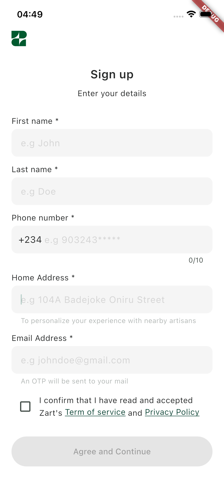
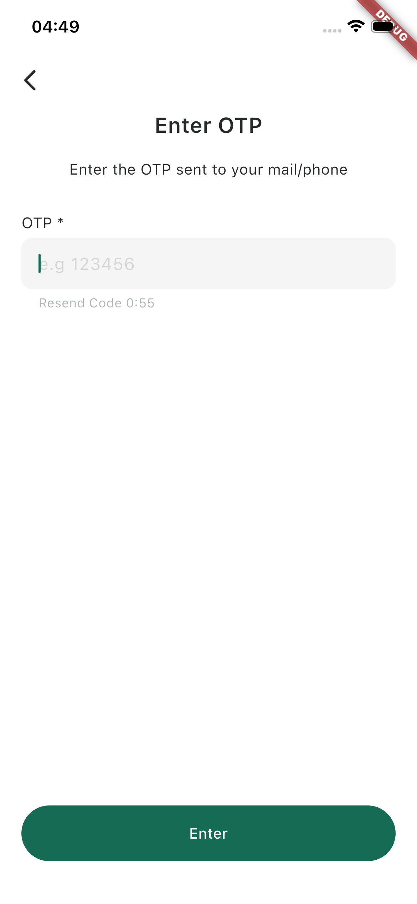

# Zart Auth UI
A minimal Flutter authentication UI

## Getting Started
### Prerequisites
- [Flutter SDK](https://docs.flutter.dev/install) 
- A connected device or emulator

### Installation
```bash
git clone https://github.com/Ayobami0/zart_auth_ui.git
cd zart_auth_ui
flutter pub get
```

### Running the app
**Android**
Download the latest APK directly from the [Releases](./releases) tab, or run on a connected device/emulator:
```bash
flutter run
```

**iOS**
Requires a macOS machine with Xcode installed. Run on a simulator or connected physical device:

```bash
flutter run
```

> iOS distribution outside the App Store requires a paid Apple Developer account.

## Preview





## Built With

- [Flutter](https://flutter.dev)
- [Riverpod](https://riverpod.dev)
- [Dio](https://pub.dev/packages/dio)
- [shared_preferences](https://pub.dev/packages/shared_preferences)
- [freezed](https://pub.dev/packages/freezed)
